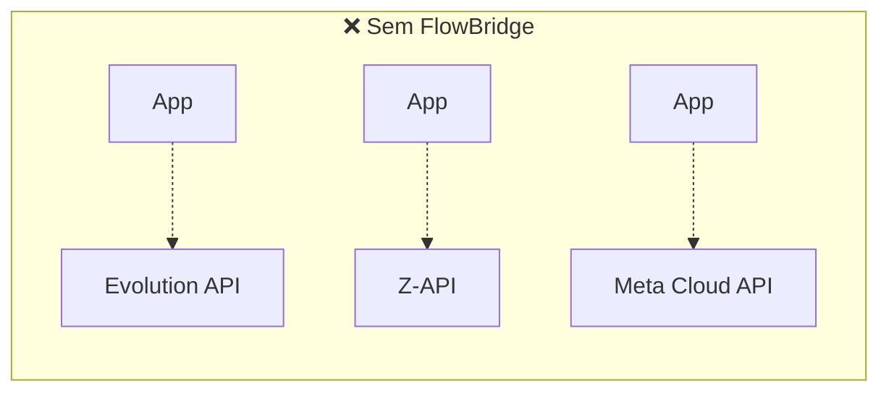
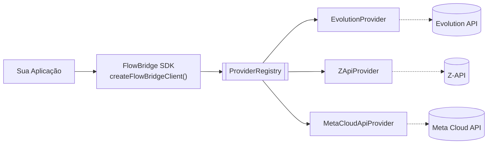
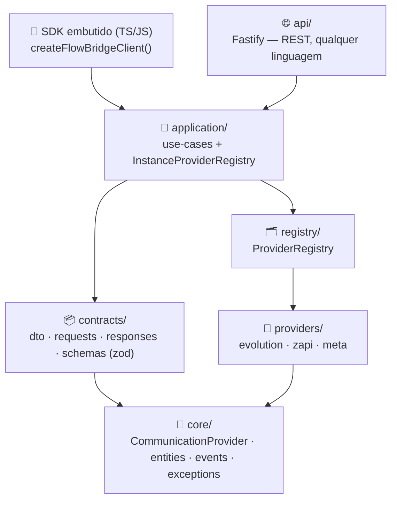

<div align="center">

# 🌉 FlowBridge

**Communication Platform para WhatsApp.**
Uma interface única para Evolution API, Z-API e a API oficial da Meta.

*Build once. Connect everywhere.*

</div>

<br>

> [!NOTE]
> Este pacote é o SDK oficial **e** a API HTTP do FlowBridge. Trocar de provider é **mudar
> configuração** — nenhum código consumidor precisa mudar. Sem regra de negócio, sem UI: só
> infraestrutura de comunicação (conexão, instância, webhook, mensagens, botões, listas,
> carrossel). Projetos TS/JS podem embutir o SDK diretamente no processo; **qualquer outra
> linguagem (PHP incluso)** fala com o [`api/`](#-api-http-api) por HTTP simples. Arquitetura
> completa em [`ARCHITECTURE.md`](./ARCHITECTURE.md) e [`VISION.md`](./VISION.md).

<br>

## 📑 Índice

- [Por que existe](#-por-que-existe)
- [Como funciona](#-como-funciona)
- [Instalação](#-instalação)
- [Início rápido](#-início-rápido)
- [Providers suportados](#-providers-suportados)
- [Matriz de capacidades](#-matriz-de-capacidades)
- [API HTTP (`api/`)](#-api-http-api)
- [Coexistence (Meta Cloud API)](#-coexistence-meta-cloud-api)
- [Logger & Eventos de domínio](#-logger--eventos-de-domínio)
- [ThrottledSender](#-throttledsender--disparos-seguros-em-prospecção)
- [Arquitetura de pastas](#-arquitetura-de-pastas)
- [Testes](#-testes)
- [Uso legado (`@sinal/evolution-client`)](#-uso-legado-sinalevolution-client)

<br>

## 🎯 Por que existe

Sem o FlowBridge, cada provider de WhatsApp traz sua própria API, autenticação, payloads e
webhooks — trocar de provider (ou usar mais de um) significa reescrever integração.



Cada seta pontilhada acima é um código de integração diferente, mantido separadamente. Com o
FlowBridge, a aplicação conhece só uma interface — o provider vira detalhe de configuração:



<br>

## ⚙️ Como funciona

Todos os providers implementam o mesmo contrato (`CommunicationProvider`). O
`ProviderRegistry` é o **único** lugar do sistema que sabe resolver um provider pelo nome —
nenhuma outra camada tem `if (provider === 'evolution')`.



Dois pontos de entrada, mesmo Core por baixo: o **SDK embutido** roda dentro do processo da
aplicação TS/JS (sem servidor, sem rede — é o que o SINAL já usa hoje); a **API HTTP**
(`api/`) é o mesmo Core exposto como serviço, para qualquer linguagem que não seja TS/Node
(ex.: PHP) ou para quem prefere gestão centralizada de instâncias. Nenhuma camada de negócio
sabe qual dos dois está sendo usado — ambos terminam no mesmo `ProviderRegistry`.

> [!TIP]
> Uma operação que um provider genuinamente não suporta (ex.: `checkNumbers` na Meta Cloud
> API) lança `UnsupportedProviderOperationException` em vez de simular um comportamento que
> não existe. Veja a [matriz de capacidades](#-matriz-de-capacidades).

<br>

## 📥 Instalação

```json
// package.json
{
  "dependencies": {
    "@sinal/evolution-client": "github:sinal-app/evolution-client"
  }
}
```

```bash
npm install
```

<br>

## 🚀 Início rápido

**1. Configure as variáveis de ambiente** do(s) provider(s) que for usar:

<table>
<tr><th>Provider</th><th>Variáveis de ambiente</th></tr>
<tr>
<td><code>evolution</code></td>
<td>

`EVOLUTION_API_URL` · `EVOLUTION_API_KEY` · `EVOLUTION_THROW_ON_ERROR` · `EVOLUTION_TIMEOUT_MS`

</td>
</tr>
<tr>
<td><code>zapi</code></td>
<td>

`ZAPI_INSTANCE_ID` · `ZAPI_TOKEN` · `ZAPI_CLIENT_TOKEN` · `ZAPI_THROW_ON_ERROR` · `ZAPI_TIMEOUT_MS`

</td>
</tr>
<tr>
<td><code>meta</code></td>
<td>

`WHATSAPP_CLOUD_PHONE_NUMBER_ID` · `WHATSAPP_CLOUD_ACCESS_TOKEN` · `WHATSAPP_CLOUD_WABA_ID` · `WHATSAPP_CLOUD_API_VERSION` · `WHATSAPP_THROW_ON_ERROR` · `WHATSAPP_TIMEOUT_MS`

</td>
</tr>
</table>

**2. Crie o client** — `createFlowBridgeClient()` sem argumentos já registra todo provider
cujas variáveis obrigatórias estiverem presentes:

```ts
import { createFlowBridgeClient } from '@sinal/evolution-client';

const flowBridge = createFlowBridgeClient();
```

Ou, com configuração explícita — dá para registrar **mais de um provider ao mesmo tempo**:

```ts
const flowBridge = createFlowBridgeClient({
  providers: [
    { name: 'evolution', baseUrl: 'https://evolution.seudominio.com', apiKey: '...' },
    { name: 'meta', phoneNumberId: '...', accessToken: '...', wabaId: '...' },
  ],
});
```

**3. Envie mensagens.** Todo método recebe um único objeto `{ provider, instanceId, ... }`:

```ts
await flowBridge.sendText({
  provider: 'evolution',
  instanceId: 'prospeccao-01',
  to: '5598999990000',
  text: 'Olá!',
});

await flowBridge.sendButtons({
  provider: 'meta',
  instanceId: 'PHONE_NUMBER_ID',
  to: '5598999990000',
  content: {
    body: 'Confirma o agendamento?',
    buttons: [
      { id: 'SIM', displayText: 'Sim' },
      { id: 'NAO', displayText: 'Não' },
    ],
  },
});

await flowBridge.sendCarousel({
  provider: 'evolution',
  instanceId: 'prospeccao-01',
  to: '5598999990000',
  content: {
    body: 'Confira nossos planos:',
    cards: [{
      title: 'Plano Pro',
      body: 'R$ 350/mês',
      imageUrl: 'https://img/pro.jpg',
      buttons: [{ id: 'PRO', displayText: 'Quero esse' }],
    }],
  },
});
```

<br>

## 🔌 Providers suportados

| | Evolution API | Z-API | Meta Cloud API |
|---|---|---|---|
| **Tipo** | Self-hosted (Baileys) | SaaS (Baileys) | API oficial do WhatsApp Business Platform |
| **Conexão** | QR code | QR code | Provisionado no Meta Business Manager |
| **Custo** | Infra própria | Assinatura | Por conversa (Meta) |
| **Ideal para** | Controle total, custo previsível | Rapidez pra subir, sem manter infra | Conta oficial verificada, escala, Coexistence |

<br>

## 📋 Matriz de capacidades

✅ suportado nativamente · ⚠️ suportado com ressalvas (leia a observação) · ❌ lança `UnsupportedProviderOperationException`

| Operação | Evolution | Z-API | Meta Cloud API |
|---|:---:|:---:|:---:|
| `connect` (instância + QR) | ✅ | ✅ | ⚠️ sem QR — número já vem provisionado; só confirma que está ativo |
| `disconnect` | ✅ | ✅ | ❌ não existe via API |
| `getStatus` | ✅ | ✅ | ⚠️ aproximado |
| `setWebhook` | ✅ | ✅ | ⚠️ só inscreve o app na WABA — URL de callback é manual no App Dashboard |
| `checkNumbers` | ✅ | ✅ | ❌ sem endpoint equivalente |
| `sendText` / `sendImage` / `sendAudio` / `sendVideo` / `sendDocument` / `sendLocation` | ✅ | ✅ | ✅ |
| `sendButtons` | ✅ | ✅ | ✅ máx. 3 botões, título ≤20 chars *(validado antes da chamada)* |
| `sendList` | ✅ com seções | ✅ seções achatadas em lista única | ✅ máx. 10 seções / 10 linhas *(validado)* |
| `sendCarousel` | ✅ freeform | ✅ freeform | ⚠️ só via template pré-aprovado — exige `providerOptions.templateName` + `languageCode` |
| `sendReaction` | ✅ | ✅ | ✅ |

<br>

## 🌐 API HTTP (`api/`)

> [!IMPORTANT]
> Existe porque **PHP (e qualquer linguagem que não seja TS/Node) não consegue importar o
> SDK** — as alternativas seriam portar a lógica pra PHP (duplica manutenção) ou chamar Node
> via shell/FFI (frágil). A API HTTP resolve isso: mesmo Core, exposto como serviço, com uma
> chave de API simples.

**1. Configure e suba o servidor:**

```env
# .env
FLOWBRIDGE_API_KEY=uma-chave-forte-aqui       # sem isso, a API fica sem autenticação (só dev local)
FLOWBRIDGE_PUBLIC_URL=https://flowbridge.seudominio.com   # usada para registrar o webhook de volta nos providers
PORT=3000

# + as env vars de provider já vistas em "Início rápido" (a Evolution é lida do ambiente
# automaticamente; Z-API e Meta são configurados por instância via POST /v1/instances)
```

```bash
npm run dev     # desenvolvimento (tsx watch)
npm run build && npm start   # produção
```

**2. Crie uma instância** — a API resolve/constrói o provider certo, chama `connect()` e já
registra o próprio `api/` como webhook do provider automaticamente:

```bash
curl -X POST https://flowbridge.seudominio.com/v1/instances \
  -H "x-api-key: uma-chave-forte-aqui" \
  -H "Content-Type: application/json" \
  -d '{
    "provider": "zapi",
    "credentials": { "instanceId": "SEU_INSTANCE_ID", "token": "SEU_TOKEN" },
    "callbackUrl": "https://seuapp.com/webhooks/whatsapp"
  }'
# → 201 { "instance": { "id": "...", "provider": "zapi", "state": "connecting", ... }, "connect": { ... } }
```

`callbackUrl` é para onde a API **repassa** os eventos normalizados (`MessageReceived`,
`MessageDelivered`, `MessageRead`, `InstanceConnected`, ...) via `POST` — não precisa
implementar nada específico de Evolution/Z-API/Meta do outro lado, só receber JSON.

**3. Envie mensagens e gerencie a instância:**

| Método | Rota | Descrição |
|---|---|---|
| `POST` | `/v1/instances` | Cria instância (resolve provider, conecta, configura webhook) |
| `GET` | `/v1/instances` | Lista instâncias |
| `GET` | `/v1/instances/:id` | Status da instância |
| `GET` | `/v1/instances/:id/qrcode` | Busca um QR **novo** sem recriar a instância — o QR do Baileys (Evolution/Z-API) expira em segundos; chame de novo se expirar (❌ 501 na Meta — não existe QR na Cloud API) |
| `DELETE` | `/v1/instances/:id` | Desconecta (❌ 501 na Meta — sem suporte) |
| `POST` | `/v1/instances/:id/check-numbers` | Valida números em lote (❌ 501 na Meta) |
| `POST` | `/v1/instances/:id/messages/:type` | Envia mensagem — `:type` = `text\|image\|audio\|video\|document\|location\|buttons\|list\|carousel\|reaction` |
| `POST` | `/v1/webhooks/:provider/:instanceId` | Recebida **do** provider — pública, sem `x-api-key` |

```bash
curl -X POST https://flowbridge.seudominio.com/v1/instances/SEU_ID/messages/text \
  -H "x-api-key: uma-chave-forte-aqui" \
  -H "Content-Type: application/json" \
  -d '{ "to": "5598999990000", "text": "Olá do PHP!" }'
```

Todas as rotas (exceto `/v1/webhooks/*`) exigem o header `x-api-key` quando
`FLOWBRIDGE_API_KEY` está configurada — requisição sem a chave certa recebe `401`.

> [!NOTE]
> `InstanceRepository` persiste em **MySQL** (`MySqlInstanceRepository`) — instâncias
> sobrevivem a restart/redeploy do container, credenciais incluídas: `InstanceProviderRegistry`
> reconstrói o `CommunicationProvider` de cada instância zapi/meta a partir do que está salvo
> no banco assim que ele é usado de novo depois de um restart. O repasse de eventos continua
> HTTP direto pra `callbackUrl` (sem fila/retry) — documentado como o próximo passo.

Todas as rotas (exceto `/v1/webhooks/*`) exigem o header `x-api-key` quando
`FLOWBRIDGE_API_KEY` está configurada — requisição sem a chave certa recebe `401`.

### 🐳 Rodando com Docker (recomendado para produção)

`docker compose` sobe três serviços: a API (`flowbridge`), o banco (`mysql`) e uma UI de
administração do banco (`adminer`) — é a forma recomendada de rodar, porque a API **exige**
MySQL configurado pra subir (sem isso, falha explicitamente no boot em vez de voltar a guardar
instância só em memória).

```bash
cp .env.example .env
# preencha FLOWBRIDGE_API_KEY, FLOWBRIDGE_PUBLIC_URL, MYSQL_PASSWORD, MYSQL_ROOT_PASSWORD
# (não precisa mexer em MYSQL_HOST — o compose já aponta pro serviço "mysql" automaticamente)

docker compose up -d --build
docker compose logs -f flowbridge   # acompanhar
docker compose down                 # parar (o volume mysql-data preserva os dados)
```

- **API**: `http://localhost:3000` (`PORT` no `.env`)
- **Adminer** (UI web do MySQL): `http://localhost:8080` — sistema **MySQL**, servidor
  `mysql`, usuário/senha = `MYSQL_USER`/`MYSQL_PASSWORD` do `.env`, banco `MYSQL_DATABASE`.
  Dá pra inspecionar/editar a tabela `instances` direto por ali, sem instalar cliente MySQL.

> [!CAUTION]
> A coluna `instances.credentials` guarda os segredos de cada instância (token da Z-API,
> access token da Meta) como **JSON em texto plano** — é o preço de reconstruir o provider
> automaticamente depois de um restart. Nunca exponha as portas do MySQL (`3306`) nem do
> Adminer (`8080`) publicamente sem VPN/rede privada, trate dump/backup do banco como material
> sensível, e restrinja `MYSQL_PASSWORD`/`MYSQL_ROOT_PASSWORD` como qualquer outro segredo (não
> commitar `.env`, já coberto pelo `.gitignore`).

Sem `docker compose` (ex.: MySQL já existe em outro lugar — RDS, Cloud SQL etc.), basta apontar
`MYSQL_HOST`/`MYSQL_PORT`/`MYSQL_USER`/`MYSQL_PASSWORD`/`MYSQL_DATABASE` pra ele no `.env` e
rodar só o container da API:

```bash
docker build -t flowbridge .
docker run -d --name flowbridge -p 3000:3000 --env-file .env --restart unless-stopped flowbridge
```

A imagem é multi-stage (build compila TS, runtime só leva `dist/` + deps de produção, roda
como usuário não-root) e expõe `GET /health` sem autenticação — usado pelo `HEALTHCHECK` da
própria imagem e serve pra load balancer/orquestrador (k8s liveness probe, etc.) apontar pra lá.

<br>

## 🔄 Coexistence (Meta Cloud API)

> [!IMPORTANT]
> Exclusivo da Cloud API: o mesmo número continua ativo no **app WhatsApp Business** (celular)
> **e** na Cloud API ao mesmo tempo, com mensagens espelhadas entre os dois lados.

`MetaCloudApiProvider` expõe métodos extras para isso — ficam fora da interface comum porque
não têm equivalente nos outros providers:

```ts
import { MetaCloudApiProvider } from '@sinal/evolution-client';

const meta = new MetaCloudApiProvider({ name: 'meta', phoneNumberId, accessToken, wabaId }, logger);

await meta.getPhoneNumberInfo();  // { isOnBizApp, platformType }
await meta.syncContacts();        // sincronização obrigatória pós-onboarding (até 24h)
await meta.syncHistory();
```

As três chaves de webhook exclusivas de Coexistence — `history`, `smb_app_state_sync`,
`smb_message_echoes` — precisam ser inscritas **manualmente no App Dashboard da Meta**; não há
chamada de API para isso. Uma vez inscritas, a [API HTTP](#-api-http-api) já reconhece e
normaliza os três (`MetaCloudApiProvider.parseWebhookPayload`), publicando como eventos de
domínio igual aos demais. Os payloads brutos ficam tipados em `contracts/dto`:

| Tipo | Descrição |
|---|---|
| `HistorySyncWebhookPayload` | Mensagens antigas, particionadas em `phase` / `chunkOrder` / `progress` |
| `SmbAppStateSyncWebhookPayload` | Contatos adicionados/removidos no app (`action: 'add' \| 'remove'`) |
| `SmbMessageEchoWebhookPayload` | Mensagens enviadas pelo app WhatsApp Business após o onboarding |

<br>

## 🧩 Logger & Eventos de domínio

```ts
import { createFlowBridgeClient, type Logger } from '@sinal/evolution-client';

const meuLogger: Logger = {
  debug: (msg, ctx) => minhaLib.debug(msg, ctx),
  info: (msg, ctx) => minhaLib.info(msg, ctx),
  warn: (msg, ctx) => minhaLib.warn(msg, ctx),
  error: (msg, ctx) => minhaLib.error(msg, ctx),
};

const flowBridge = createFlowBridgeClient({
  logger: meuLogger,
  eventPublisher: { publish: (event) => meuBarramento.emit(event.type, event) },
});
```

| Evento | Quando dispara |
|---|---|
| `InstanceConnected` | Instância fica com `state: 'open'` |
| `InstanceDisconnected` | `disconnect()` é chamado com sucesso |
| `QRCodeGenerated` | Um novo QR code é retornado por `connect()` |
| `MessageSent` | Qualquer `send*` é concluído |

`MessageReceived` / `MessageDelivered` / `MessageRead` têm o formato definido em
`core/events` e são emitidos pela [API HTTP](#-api-http-api) — o SDK embutido sozinho não roda
servidor, então não recebe webhooks inbound diretamente; quem processa webhook é sempre o
`api/`, que repassa o evento já normalizado para o `callbackUrl` da instância.

<br>

## 🛡️ ThrottledSender — disparos seguros em prospecção

```ts
import { ThrottledSender, createFlowBridgeClient } from '@sinal/evolution-client';

const flowBridge = createFlowBridgeClient();
const sender = new ThrottledSender({ minMs: 8_000, maxMs: 15_000 });

const valid = await flowBridge.checkNumbers({
  provider: 'evolution',
  instanceId: 'prospeccao-01',
  numbers: rawNumbers,
});

await sender.batch(
  valid,
  (number) => flowBridge.sendText({ provider: 'evolution', instanceId: 'prospeccao-01', to: number, text: mensagem }),
  {
    onSent:  (n, _, i, total) => console.log(`[${i}/${total}] ✓ ${n}`),
    onError: (n, err, i)      => console.error(`[${i}] ✗ ${n}: ${err.message}`),
  },
);
```

> [!WARNING]
> Nunca use delay < 8s em instâncias Baileys (Evolution/Z-API) em produção — rajadas
> aumentam o score de ban da instância.

<br>

## 📁 Arquitetura de pastas

<details>
<summary><strong>Ver árvore completa de <code>src/</code></strong></summary>

```
src/
  core/            → CommunicationProvider, entidades, value objects, eventos, exceptions
                     (não conhece HTTP, providers nem frameworks)
  contracts/       → dto · requests · responses · events · schemas (zod)
                     linguagem pública estável do SDK e da API
  providers/       → EvolutionProvider · ZApiProvider · MetaCloudApiProvider
                     cada um implementa CommunicationProvider (+ parseWebhookPayload), isolados entre si
  registry/        → ProviderRegistry — único lugar que resolve provider por *tipo*
  application/     → use-cases (SDK embutido) + InstanceProviderRegistry (multi-tenant da API) + factory
  infrastructure/  → ConsoleLogger · wrapper HTTP compartilhado · MySqlInstanceRepository
                     (produção) / InMemoryInstanceRepository (testes) · HttpForwardingEventPublisher
  api/             → Fastify — routes/controllers/middlewares + buildServer() (testável via
                     app.inject()) + server.ts (entrypoint real, usado por `npm run dev`/`start`)
  config/          → leitura de variáveis de ambiente por provider + da API + MySQL
  compat/          → EvolutionClient / createEvolutionClient legados (ver seção abaixo)
```

Redis, filas (RabbitMQ/Kafka) e o Dashboard Administrativo continuam **fora de escopo** — o
repasse de eventos (`HttpForwardingEventPublisher`) é o próximo a virar fila real; troca por
outra implementação de `EventPublisher`/`InstanceRepository` sem tocar em Core/Providers/`api/`
(só a peça de `infrastructure/` muda — foi exatamente assim que `InstanceRepository` saiu de
em-memória pra MySQL).

</details>

<br>

## 🧪 Testes

```bash
npm test
```

<br>

---

## 📦 Uso legado (`@sinal/evolution-client`)

<details>
<summary><strong>O SINAL e o módulo de prospecção já consomem este pacote hoje via
<code>EvolutionClient</code> — clique para ver a API legada, mantida 100% compatível</strong></summary>

<br>

> [!NOTE]
> `EvolutionClient` e `createEvolutionClient` continuam funcionando exatamente como antes.
> São uma fachada independente em `src/compat/`, congelada de propósito para não arriscar
> mudar comportamento em produção durante a evolução para o FlowBridge.

### Criando o client

```ts
import { createEvolutionClient } from '@sinal/evolution-client';

const client = createEvolutionClient(); // lê EVOLUTION_API_URL / EVOLUTION_API_KEY do .env
```

```ts
import { EvolutionClient } from '@sinal/evolution-client';

const client = new EvolutionClient({
  baseUrl: 'https://evolution.seudominio.com',
  apiKey: process.env.EVOLUTION_API_KEY!,
  throwOnError: true, // lança EvolutionApiError em 4xx/5xx
});
```

### Referência

```ts
await client.createInstance({ instanceName: 'prospeccao-01' });
await client.setWebhook('prospeccao-01', { enabled: true, url: 'https://seuapp.com/webhook/whatsapp', events: ['MESSAGES_UPSERT'] });
await client.getQrCode('prospeccao-01');
await client.getInstanceStatus('prospeccao-01');
await client.deleteInstance('prospeccao-01');

const valid = await client.checkNumbers('prospeccao-01', ['5598999990000', '5511000000000']);
// → ['5598999990000']

await client.sendText('instancia', '5598999990000', 'Olá!');
await client.sendImage('instancia', '5598999990000', 'https://img.url/foto.jpg', 'Legenda');
await client.sendAudio('instancia', '5598999990000', 'https://audio.url/voz.ogg');
await client.sendDocument('instancia', '5598999990000', 'https://url/proposta.pdf', 'proposta.pdf');

await client.sendButtons('instancia', '5598999990000', 'Título', 'Corpo', 'Rodapé', [
  { type: 'reply', displayText: 'Sim', id: 'BTN_SIM' },
  { type: 'reply', displayText: 'Não', id: 'BTN_NAO' },
]);

await client.sendCarousel('instancia', '5598999990000', 'Confira nossos planos:', [
  { title: 'Plano Pro', body: 'R$ 350/mês', footer: 'Mais popular', imageUrl: 'https://img.url/pro.jpg', buttons: [{ type: 'reply', displayText: 'Quero esse', id: 'PLANO_PRO' }] },
]);

await client.sendReaction('instancia', '5598999990000', 'MSG_ID_AQUI', '👍');
```

### Tratamento de erros

```ts
import { EvolutionApiError, createEvolutionClient } from '@sinal/evolution-client';

const client = createEvolutionClient({ throwOnError: true });

try {
  await client.sendText('inst', '5598999990000', 'Olá');
} catch (err) {
  if (err instanceof EvolutionApiError) {
    console.error(err.statusCode);  // 422, 500, etc.
    console.error(err.endpoint);    // '/message/sendText/inst'
    console.error(err.responseBody);
  }
}
```

Com `throwOnError: false` (padrão), erros são logados silenciosamente — mesmo comportamento
do `EvolutionService.php` original do SINAL.

### Como atualizar nos projetos consumidores

```bash
npm install github:sinal-app/evolution-client
```

Ou fixe uma tag de release:

```json
"@sinal/evolution-client": "github:sinal-app/evolution-client#v2.0.0"
```

</details>
