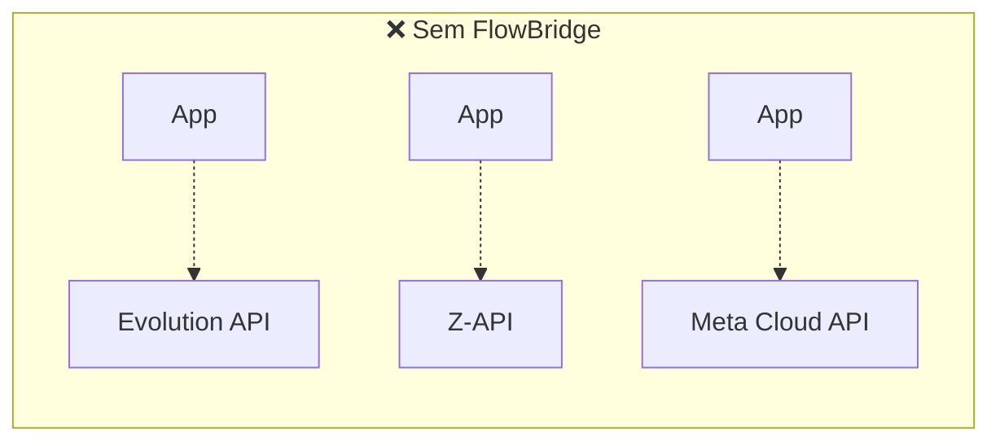
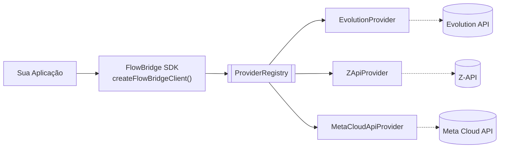
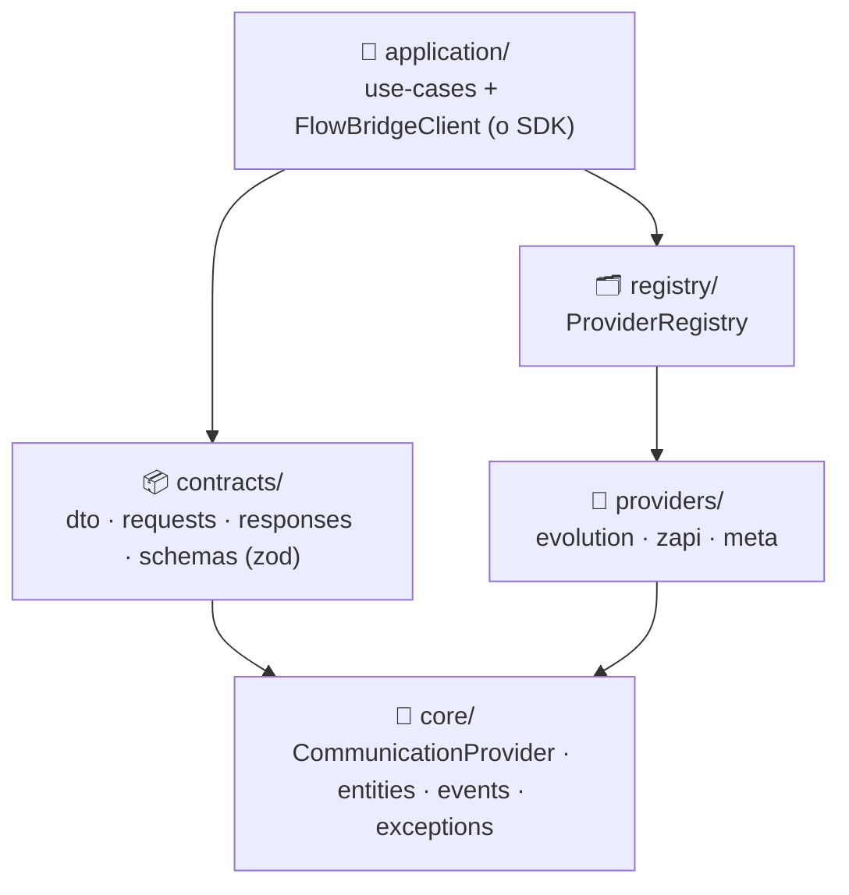

<div align="center">

# 🌉 FlowBridge

**Communication Platform para WhatsApp.**
Uma interface única para Evolution API, Z-API e a API oficial da Meta.

*Build once. Connect everywhere.*

</div>

<br>

> [!NOTE]
> Este pacote é o SDK oficial. Trocar de provider é **mudar configuração** — nenhum código
> consumidor precisa mudar. Sem regra de negócio, sem UI, sem servidor HTTP próprio: só
> infraestrutura de comunicação (conexão, instância, webhook, mensagens, botões, listas,
> carrossel). Arquitetura completa em [`ARCHITECTURE.md`](./ARCHITECTURE.md) e
> [`VISION.md`](./VISION.md).

<br>

## 📑 Índice

- [Por que existe](#-por-que-existe)
- [Como funciona](#-como-funciona)
- [Instalação](#-instalação)
- [Início rápido](#-início-rápido)
- [Providers suportados](#-providers-suportados)
- [Matriz de capacidades](#-matriz-de-capacidades)
- [Coexistence (Meta Cloud API)](#-coexistence-meta-cloud-api)
- [Logger & Eventos de domínio](#-logger--eventos-de-domínio)
- [ThrottledSender](#-throttledsender--disparos-seguros-em-prospecção)
- [Arquitetura de pastas](#-arquitetura-de-pastas)
- [Testes](#-testes)
- [Uso legado (`@sinal/evolution-client`)](#-uso-legado-sinalevolution-client)

<br>

## 🎯 Por que existe

Sem o FlowBridge, cada provider de WhatsApp traz sua própria API, autenticação, payloads e
webhooks — trocar de provider (ou usar mais de um) significa reescrever integração.



Cada seta pontilhada acima é um código de integração diferente, mantido separadamente. Com o
FlowBridge, a aplicação conhece só uma interface — o provider vira detalhe de configuração:



<br>

## ⚙️ Como funciona

Todos os providers implementam o mesmo contrato (`CommunicationProvider`). O
`ProviderRegistry` é o **único** lugar do sistema que sabe resolver um provider pelo nome —
nenhuma outra camada tem `if (provider === 'evolution')`.



> [!TIP]
> Uma operação que um provider genuinamente não suporta (ex.: `checkNumbers` na Meta Cloud
> API) lança `UnsupportedProviderOperationException` em vez de simular um comportamento que
> não existe. Veja a [matriz de capacidades](#-matriz-de-capacidades).

<br>

## 📥 Instalação

```json
// package.json
{
  "dependencies": {
    "@sinal/evolution-client": "github:sinal-app/evolution-client"
  }
}
```

```bash
npm install
```

<br>

## 🚀 Início rápido

**1. Configure as variáveis de ambiente** do(s) provider(s) que for usar:

<table>
<tr><th>Provider</th><th>Variáveis de ambiente</th></tr>
<tr>
<td><code>evolution</code></td>
<td>

`EVOLUTION_API_URL` · `EVOLUTION_API_KEY` · `EVOLUTION_THROW_ON_ERROR` · `EVOLUTION_TIMEOUT_MS`

</td>
</tr>
<tr>
<td><code>zapi</code></td>
<td>

`ZAPI_INSTANCE_ID` · `ZAPI_TOKEN` · `ZAPI_CLIENT_TOKEN` · `ZAPI_THROW_ON_ERROR` · `ZAPI_TIMEOUT_MS`

</td>
</tr>
<tr>
<td><code>meta</code></td>
<td>

`WHATSAPP_CLOUD_PHONE_NUMBER_ID` · `WHATSAPP_CLOUD_ACCESS_TOKEN` · `WHATSAPP_CLOUD_WABA_ID` · `WHATSAPP_CLOUD_API_VERSION` · `WHATSAPP_THROW_ON_ERROR` · `WHATSAPP_TIMEOUT_MS`

</td>
</tr>
</table>

**2. Crie o client** — `createFlowBridgeClient()` sem argumentos já registra todo provider
cujas variáveis obrigatórias estiverem presentes:

```ts
import { createFlowBridgeClient } from '@sinal/evolution-client';

const flowBridge = createFlowBridgeClient();
```

Ou, com configuração explícita — dá para registrar **mais de um provider ao mesmo tempo**:

```ts
const flowBridge = createFlowBridgeClient({
  providers: [
    { name: 'evolution', baseUrl: 'https://evolution.seudominio.com', apiKey: '...' },
    { name: 'meta', phoneNumberId: '...', accessToken: '...', wabaId: '...' },
  ],
});
```

**3. Envie mensagens.** Todo método recebe um único objeto `{ provider, instanceId, ... }`:

```ts
await flowBridge.sendText({
  provider: 'evolution',
  instanceId: 'prospeccao-01',
  to: '5598999990000',
  text: 'Olá!',
});

await flowBridge.sendButtons({
  provider: 'meta',
  instanceId: 'PHONE_NUMBER_ID',
  to: '5598999990000',
  content: {
    body: 'Confirma o agendamento?',
    buttons: [
      { id: 'SIM', displayText: 'Sim' },
      { id: 'NAO', displayText: 'Não' },
    ],
  },
});

await flowBridge.sendCarousel({
  provider: 'evolution',
  instanceId: 'prospeccao-01',
  to: '5598999990000',
  content: {
    body: 'Confira nossos planos:',
    cards: [{
      title: 'Plano Pro',
      body: 'R$ 350/mês',
      imageUrl: 'https://img/pro.jpg',
      buttons: [{ id: 'PRO', displayText: 'Quero esse' }],
    }],
  },
});
```

<br>

## 🔌 Providers suportados

| | Evolution API | Z-API | Meta Cloud API |
|---|---|---|---|
| **Tipo** | Self-hosted (Baileys) | SaaS (Baileys) | API oficial do WhatsApp Business Platform |
| **Conexão** | QR code | QR code | Provisionado no Meta Business Manager |
| **Custo** | Infra própria | Assinatura | Por conversa (Meta) |
| **Ideal para** | Controle total, custo previsível | Rapidez pra subir, sem manter infra | Conta oficial verificada, escala, Coexistence |

<br>

## 📋 Matriz de capacidades

✅ suportado nativamente · ⚠️ suportado com ressalvas (leia a observação) · ❌ lança `UnsupportedProviderOperationException`

| Operação | Evolution | Z-API | Meta Cloud API |
|---|:---:|:---:|:---:|
| `connect` (instância + QR) | ✅ | ✅ | ⚠️ sem QR — número já vem provisionado; só confirma que está ativo |
| `disconnect` | ✅ | ✅ | ❌ não existe via API |
| `getStatus` | ✅ | ✅ | ⚠️ aproximado |
| `setWebhook` | ✅ | ✅ | ⚠️ só inscreve o app na WABA — URL de callback é manual no App Dashboard |
| `checkNumbers` | ✅ | ✅ | ❌ sem endpoint equivalente |
| `sendText` / `sendImage` / `sendAudio` / `sendVideo` / `sendDocument` / `sendLocation` | ✅ | ✅ | ✅ |
| `sendButtons` | ✅ | ✅ | ✅ máx. 3 botões, título ≤20 chars *(validado antes da chamada)* |
| `sendList` | ✅ com seções | ✅ seções achatadas em lista única | ✅ máx. 10 seções / 10 linhas *(validado)* |
| `sendCarousel` | ✅ freeform | ✅ freeform | ⚠️ só via template pré-aprovado — exige `providerOptions.templateName` + `languageCode` |
| `sendReaction` | ✅ | ✅ | ✅ |

<br>

## 🔄 Coexistence (Meta Cloud API)

> [!IMPORTANT]
> Exclusivo da Cloud API: o mesmo número continua ativo no **app WhatsApp Business** (celular)
> **e** na Cloud API ao mesmo tempo, com mensagens espelhadas entre os dois lados.

`MetaCloudApiProvider` expõe métodos extras para isso — ficam fora da interface comum porque
não têm equivalente nos outros providers:

```ts
import { MetaCloudApiProvider } from '@sinal/evolution-client';

const meta = new MetaCloudApiProvider({ name: 'meta', phoneNumberId, accessToken, wabaId }, logger);

await meta.getPhoneNumberInfo();  // { isOnBizApp, platformType }
await meta.syncContacts();        // sincronização obrigatória pós-onboarding (até 24h)
await meta.syncHistory();
```

As três chaves de webhook exclusivas de Coexistence — `history`, `smb_app_state_sync`,
`smb_message_echoes` — precisam ser inscritas **manualmente no App Dashboard da Meta**; não há
chamada de API para isso. Os payloads já estão tipados em `contracts/dto` para quem for
implementar o endpoint receptor:

| Tipo | Descrição |
|---|---|
| `HistorySyncWebhookPayload` | Mensagens antigas, particionadas em `phase` / `chunkOrder` / `progress` |
| `SmbAppStateSyncWebhookPayload` | Contatos adicionados/removidos no app (`action: 'add' \| 'remove'`) |
| `SmbMessageEchoWebhookPayload` | Mensagens enviadas pelo app WhatsApp Business após o onboarding |

<br>

## 🧩 Logger & Eventos de domínio

```ts
import { createFlowBridgeClient, type Logger } from '@sinal/evolution-client';

const meuLogger: Logger = {
  debug: (msg, ctx) => minhaLib.debug(msg, ctx),
  info: (msg, ctx) => minhaLib.info(msg, ctx),
  warn: (msg, ctx) => minhaLib.warn(msg, ctx),
  error: (msg, ctx) => minhaLib.error(msg, ctx),
};

const flowBridge = createFlowBridgeClient({
  logger: meuLogger,
  eventPublisher: { publish: (event) => meuBarramento.emit(event.type, event) },
});
```

| Evento | Quando dispara |
|---|---|
| `InstanceConnected` | Instância fica com `state: 'open'` |
| `InstanceDisconnected` | `disconnect()` é chamado com sucesso |
| `QRCodeGenerated` | Um novo QR code é retornado por `connect()` |
| `MessageSent` | Qualquer `send*` é concluído |

`MessageReceived` / `MessageDelivered` / `MessageRead` já têm o formato definido em
`core/events`, mas **não são emitidos pelo SDK ainda** — ele não roda servidor, então não
recebe webhooks inbound. Ficam prontos para quando essa camada existir.

<br>

## 🛡️ ThrottledSender — disparos seguros em prospecção

```ts
import { ThrottledSender, createFlowBridgeClient } from '@sinal/evolution-client';

const flowBridge = createFlowBridgeClient();
const sender = new ThrottledSender({ minMs: 8_000, maxMs: 15_000 });

const valid = await flowBridge.checkNumbers({
  provider: 'evolution',
  instanceId: 'prospeccao-01',
  numbers: rawNumbers,
});

await sender.batch(
  valid,
  (number) => flowBridge.sendText({ provider: 'evolution', instanceId: 'prospeccao-01', to: number, text: mensagem }),
  {
    onSent:  (n, _, i, total) => console.log(`[${i}/${total}] ✓ ${n}`),
    onError: (n, err, i)      => console.error(`[${i}] ✗ ${n}: ${err.message}`),
  },
);
```

> [!WARNING]
> Nunca use delay < 8s em instâncias Baileys (Evolution/Z-API) em produção — rajadas
> aumentam o score de ban da instância.

<br>

## 📁 Arquitetura de pastas

<details>
<summary><strong>Ver árvore completa de <code>src/</code></strong></summary>

```
src/
  core/            → CommunicationProvider, entidades, value objects, eventos, exceptions
                     (não conhece HTTP, providers nem frameworks)
  contracts/       → dto · requests · responses · events · schemas (zod)
                     linguagem pública estável do SDK
  providers/       → EvolutionProvider · ZApiProvider · MetaCloudApiProvider
                     cada um implementa CommunicationProvider, isolados entre si
  registry/        → ProviderRegistry — único lugar que resolve provider por nome
  application/     → use-cases (um por operação) + FlowBridgeClient (a fachada = o SDK) + factory
  infrastructure/  → ConsoleLogger + wrapper HTTP compartilhado pelos providers
  config/          → leitura de variáveis de ambiente por provider
  compat/          → EvolutionClient / createEvolutionClient legados (ver seção abaixo)
```

`api/` (HTTP), infraestrutura persistente (banco, filas) e o Dashboard Administrativo estão
**fora de escopo por enquanto** — entram como camada por cima do que já existe, sem tocar em
Core/Providers.

</details>

<br>

## 🧪 Testes

```bash
npm test
```

<br>

---

## 📦 Uso legado (`@sinal/evolution-client`)

<details>
<summary><strong>O SINAL e o módulo de prospecção já consomem este pacote hoje via
<code>EvolutionClient</code> — clique para ver a API legada, mantida 100% compatível</strong></summary>

<br>

> [!NOTE]
> `EvolutionClient` e `createEvolutionClient` continuam funcionando exatamente como antes.
> São uma fachada independente em `src/compat/`, congelada de propósito para não arriscar
> mudar comportamento em produção durante a evolução para o FlowBridge.

### Criando o client

```ts
import { createEvolutionClient } from '@sinal/evolution-client';

const client = createEvolutionClient(); // lê EVOLUTION_API_URL / EVOLUTION_API_KEY do .env
```

```ts
import { EvolutionClient } from '@sinal/evolution-client';

const client = new EvolutionClient({
  baseUrl: 'https://evolution.seudominio.com',
  apiKey: process.env.EVOLUTION_API_KEY!,
  throwOnError: true, // lança EvolutionApiError em 4xx/5xx
});
```

### Referência

```ts
await client.createInstance({ instanceName: 'prospeccao-01' });
await client.setWebhook('prospeccao-01', { enabled: true, url: 'https://seuapp.com/webhook/whatsapp', events: ['MESSAGES_UPSERT'] });
await client.getQrCode('prospeccao-01');
await client.getInstanceStatus('prospeccao-01');
await client.deleteInstance('prospeccao-01');

const valid = await client.checkNumbers('prospeccao-01', ['5598999990000', '5511000000000']);
// → ['5598999990000']

await client.sendText('instancia', '5598999990000', 'Olá!');
await client.sendImage('instancia', '5598999990000', 'https://img.url/foto.jpg', 'Legenda');
await client.sendAudio('instancia', '5598999990000', 'https://audio.url/voz.ogg');
await client.sendDocument('instancia', '5598999990000', 'https://url/proposta.pdf', 'proposta.pdf');

await client.sendButtons('instancia', '5598999990000', 'Título', 'Corpo', 'Rodapé', [
  { type: 'reply', displayText: 'Sim', id: 'BTN_SIM' },
  { type: 'reply', displayText: 'Não', id: 'BTN_NAO' },
]);

await client.sendCarousel('instancia', '5598999990000', 'Confira nossos planos:', [
  { title: 'Plano Pro', body: 'R$ 350/mês', footer: 'Mais popular', imageUrl: 'https://img.url/pro.jpg', buttons: [{ type: 'reply', displayText: 'Quero esse', id: 'PLANO_PRO' }] },
]);

await client.sendReaction('instancia', '5598999990000', 'MSG_ID_AQUI', '👍');
```

### Tratamento de erros

```ts
import { EvolutionApiError, createEvolutionClient } from '@sinal/evolution-client';

const client = createEvolutionClient({ throwOnError: true });

try {
  await client.sendText('inst', '5598999990000', 'Olá');
} catch (err) {
  if (err instanceof EvolutionApiError) {
    console.error(err.statusCode);  // 422, 500, etc.
    console.error(err.endpoint);    // '/message/sendText/inst'
    console.error(err.responseBody);
  }
}
```

Com `throwOnError: false` (padrão), erros são logados silenciosamente — mesmo comportamento
do `EvolutionService.php` original do SINAL.

### Como atualizar nos projetos consumidores

```bash
npm install github:sinal-app/evolution-client
```

Ou fixe uma tag de release:

```json
"@sinal/evolution-client": "github:sinal-app/evolution-client#v2.0.0"
```

</details>
